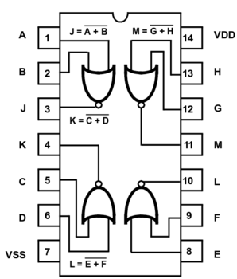
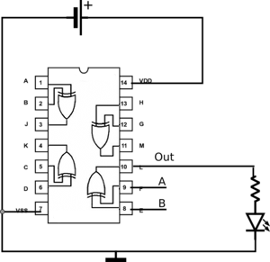

Existem diversas famílias de Circuitos Integrados (CI) que já possuem a implementação da porta lógica, conforme figura extraída do manual a seguir:

O uso dos CIs reduz a complexidade da placa já que não é mais necessário utilizar transistor de forma discreto para a implementação da porta lógica, podemos simplesmente utilizar um componente dedicado a isso.

Esses componentes de maneira geral possuem não uma porta lógica mas várias do mesmo tipo, minimizando assim a quantidade de CIs em uma placa.

!!! note
    Utilize a mesma técnica da aula passada!
    As entradas serão "jumpers" e as saídas Leds.

!!! warning
    Não esqueça de conectar sempre um resistor em série com o LED.

E devem implementar as seguintes equações lógicas:

### A)  A XOR B = OUT

Que pode ser implementando com o uso da CI **4070** que possui 4 XORs

Note que os nós A e B são entradas da XOR (pinos 8 e 9 respectivamente) e a saída (pino 10) está conectado a um resistor no led e então para o terra.

Para saber contar os pinos do chip encontre o chanfro e começo a contar no sentido anti-horário.

### B) Equação

Temos disponível no laboratório os seguintes CIs da família 40xx que podem ser utilizados para montar o circuito.

- [CD4015, CD4016, CD4017, CD4020, CD4023, CD4024, CD4027, CD4040, CD4046, CD4050, CD4051, CD4069, CD4070, CD4071, CD4081, CD4093, CD4511, CD4538, CD4543, CD4584 CD4001, CD4011, CD4013, CD4049, CD4066](https://en.wikipedia.org/wiki/List_of_4000-series_integrated_circuits). 

!!! note
    Qual você vai precisar usar para montar essa equação?

### C) Chip misterioso ....

1. Descubra qual a lógica por detrás do chip misterioso. 
2. Explique em um texto o que esse chip faz
3. De exemplos de uso

!!! note
    Quando chegar aqui procure por algum técnico da 404

### D) Trabalhando com NAND

Utilizando o simulador [`logic.ly`](http://logic.ly/demo/) implemente as seguintes portas lógicas utilizando somente **NANDs**:

- NOT
- AND
- OR
- XOR
- NOR
- XNOR

### D') Implementando

Escolha uma das portas e valide o simulador montando na protoboard.

