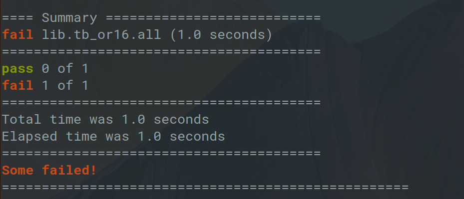
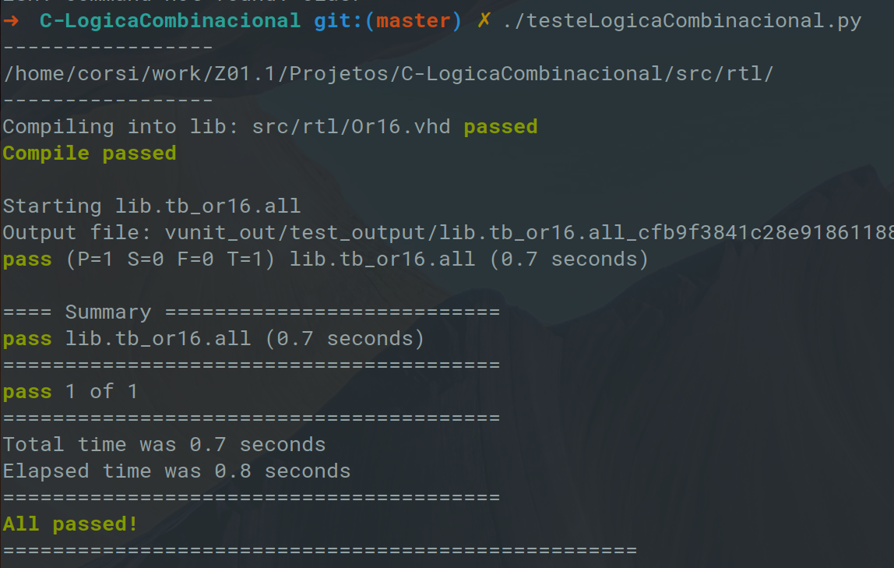

- **INDIVIDUAL**

Executar antes!

```bash
$ git submodule update --init --recursive
$ git submodule foreach 'git stash; git checkout master; git pull'
```

---------

Vamos iremos trabalharmos em implementarmos a porta `or16` (que é uma parte do projeto C), para isso iremos editar o arquivo de configuração `/Z01.1/Projetos/C-LogicaCombinacional/tests/config.txt` comentando os demais módulos menos o `Or16`:

```diff
######################################
# Rafael.Corsi @ Insper.edu.br       #
#  Elementos de Sistemas             # 
#                                    # 
# Arquivos de teste do projeto C     #
#  - Para incluir o teste basta      #
#  descomentar a linha               #
#                                    #
######################################

#nand.vhd
#Nor8Way.vhd
#And16.vhd
#Not16.vhd
#Or8Way.vhd
+Or16.vhd
#DMux2Way.vhd
#DMux4Way.vhd
#DMux8Way.vhd
#Mux2Way.vhd
#Mux4Way.vhd
#Mux16.vhd
#Mux4Way16.vhd
#Mux8Way.vhd
#Mux8Way16.vhd
```

Abra o terminal na pasta `C-Logica-Combinacional/` e execute o script python:

```bash
$ ./testeLogicaCombinacional.py
```

O mesmo irá executar a compilação dos arquivos `src/rtl/*.vhd` e realizar testes unitários em cada um desses módulos, como os módulos não estão implementados e como estamos forçando o teste do `or16` devemos ter um erro nesse módulo.



Esse erro acontece pois o mesmo ainda não foi implementado:

```vhd
library IEEE;
use IEEE.STD_LOGIC_1164.ALL;

entity Or16 is
	port ( 
			a:   in  STD_LOGIC_VECTOR(15 downto 0);
			b:   in  STD_LOGIC_VECTOR(15 downto 0);
			q:   out STD_LOGIC_VECTOR(15 downto 0));
end entity;

architecture arch of Or16 is
begin


end architecture;
```

Vamos agora editar esse arquivo para realizar sua implementação. Essa modificação deve ser salva em novo branch **or16**. Dentro do terminal (na pasta do projeto C):

``` bash
$ git checkout -B or16
```

Modifique o arquivo `or16` para implementar uma OR

`/Z01.1/C-LogicaCombinacional/src/rtl/or16.vhd`


Execute o comando no terminal para testarmos a implementação.

``` bash
$ ./testeLogicaCombinacional.py
```



Realizando o commit:

``` bash
$ git commit -am "funcionando e testado"
```

Agora vamos enviar para o servidor (repositório git remoto) o novo branch `or16`:

``` bash
$ git push origin or16
```

# [Próximos passos](B-Circuitos-Integrados-Lab-2)

Ágora é necessário que o desenvolvedor gerar o pullrequest para que o mediador tenha conhecimento da sua implementação. Se no grupo mais de uma pessoa fez a implementação, **gere somente um PULL REQUEST**

1. Desenvolvedor gera pullrequest 
1. Mediador analisa/ aprova o pullrequest.

