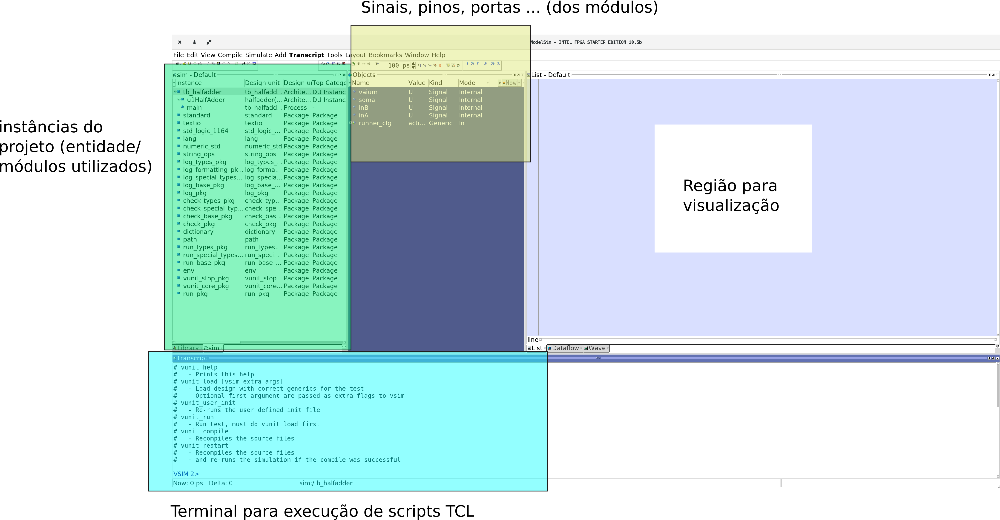
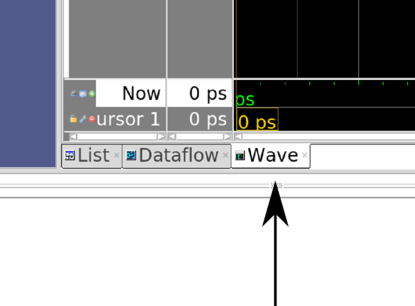
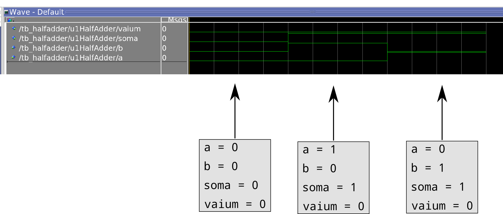

```diff
+ Realizar em grupo (projetar)
```

Iremos nesse laboratório editar a configuração do `Travis` para tevstar um novo projeto em seguida iremos explorar como os testes dos módulos em VHDL são realizados (testbench).

1. Configurando Travis
1. Implementando `halfAdder`
1. Visualizando teste
1. Aprimorando teste `halfAdder`

# 1. Configurando Travis

> **Facilitador (chapéu) deve realizar porém todos devem acompanhar**. Usar o monitor!

Até agora vocês utilizaram o Travis de maneira transparente, sem entender muito como ele foi configurado. Nessa nova etapa do desenvolvimento do computador `Z01` iremos modificar o arquivo de configuração do Travis para que ele posso executar os novos scripts de teste (testar o desenvolvimento da ULA).

Note que no diretório raiz do repositório Z01.1 temos um arquivo **oculto** chamado `.travis.yml` (usuários LINUX esse arquivo estará oculto. Para exibir no gerenciador de arquivos `ctrl` + `h`, ou `ls -a` no terminal), esse arquivo faz toda a configuração do teste de integração contínua e é dividido em algumas partes:

1. Configuração da máquina virtual
    - ubuntu 16.04
2. Instalação das dependências:
    - python
    - quartus (no Travis instalamos somente o modelsim)
    - java
3. Execução dos scripts de teste

Nessa etapa estamos interessados em adicionar mais um script de teste ao Travis (o script que testa a ULA, `testeULA.py`). Para isso abra o arquivo `.travis.yml` e na secção referente aos scripts, adicione a linha como demonstrado a seguir:

```diff
script:
 - python Projetos/C-LogicaCombinacional/testeLogicaCombinacional.py
+- python Projetos/D-UnidadeLogicaAritmetica/testeULA.py
```

Agora, toda vez que o repositório remoto (`origin`) sofrer alguma variação, o Travis irá executar os dois scripts de teste (projeto C e projeto D).


```diff
- Salve e submeta as alterações
``` 

1. no master ('git checkout master')
1. faça um commit com essa alteração ('git add .travis.yml' + 'git commit -m "adicionado teste D"')
1. faça o push ('git push origin master')

# 2. Implementando o half-adder

O half-adder é um dispositivo somador binário que possui duas entradas binárias (a,b) e duas saídas binária (soma dos bits (Soma) e o carry (vaium)). A tabela verdade desse componente é detalhada a seguir:

| a | b | Soma | Vaium |
|---|---|------|-------|
| 0 | 0 |    0 |     0 |
| 0 | 1 |    1 |     0 |
| 1 | 0 |    1 |     0 |
| 1 | 1 |    0 |     1 |

Com a tabela verdade podemos extrair as duas equações que descreve esse componente: Soma e Vaium.

-  `soma = a xor b`
-  `vaium = a and b`

> Lembre que: not(a) b + a not(b) = a xor b

1. Agora com a equação definida é possível realizarmos uma descrição em `VHDL` do componente `halfadder`. Abra o arquivo  `D-UnidadeLogicaAritmetica/src/rtl/HalfAdder.vhd` e modifique sua arquitetura para implementar a equação do halfadder. 

2. Edite o arquivo de configuração do teste `tests/config.txt` e descomente a linha referente ao `halfadder`.

3. Valide a implementação executando o script de testes: `testeULA.py`

# 3. Visualizando a simulação

É muito difícil sabermos porque uma implementação em VHDL não funciona, atualmente o fluxo é: transcreve para VHDL o componente; testa; não funcionou volta para o VHDL; testa.... Será que não existe uma forma de conseguirmos visualizar o resultado do teste e com isso mudarmos a implementação em VDHL? Sim existe! Para isso será necessário invocarmos a parte gráfica do modelsim. 
Na hora de invocarmos o script de teste (`D-UnidadeLogicaAritmetica/testeULA.py`) passe o parâmetro `--gui` (ou `-g`), como a seguir:

```bash
$ python testeULA.py --gui
```

Esse comando irá executar a simulação e abrir no software `modelsim` (toda a simulação é realizada por esse software, mas estava sendo 'mascarada' pelos scripts de teste em py).

> Antes de continuar, o módulo do `HalfAdder.vhd` já deve está implementando e testado (na forma tradicional).

## modelsim

O [modelsim](https://www.mentor.com/company/higher_ed/modelsim-student-edition) não possui uma interface moderna, porém é o software de simulação de hardware mais completo e mais utilizado pela industria. Siga os passos a seguir para conseguirmos visualizarmos a forma de onda:



Primeiramente devemos adicionar os sinais que desejamos visualizar, no caso do HalfAdder queremos ver suas entradas (a,b) e suas saídas (soma, vaium).

Para isso clique em **wave**:



E depois selecione no menu das instâncias o módulo u1HalfAdder, com isso poderemos selecionar quais pinos/ sinais gostaríamos de visualizar desse bloco. Arraste todos os sinais para o wave form :


Resultando em:


Agora podemos executar a simulação, na região do script TCL execute o seguinte comando: **vunit_run**

```tcl
VSIM 7> vunit_run
```

Podemos agora visualizar a forma de onda:



# 4. Aprimorando teste

Testbench (bancada de teste) é a forma utilizada para verificarmos se um projeto de HDL (VHDL, Verilog, ...) está certo, o testbench pode ser escrito em várias linguagens inclusive em VHDL.

Os TestBenchs estão localizados nas pastas dos projetos em: `/tests/tst/`.

No projeto D temos os seguintes testbenchs definidos (um para cada módulo a ser implementando):

```bash
/tests/tst/
          tb_Add16.vhd
          tb_ALU.vhd
          tb_comparador16.vhd
          tb_FullAdder.vhd
          tb_HalfAdder.vhd
          tb_Inc16.vhd
          tb_inversor16.vhd
          tb_zerador16.vhd
```

> Nesse projeto os testes não estão completos, será necessário implementar o resto dos testes.

## tb_HalfAdder.vhd

Note que na simulação do HalfAdder não testamos um dos casos de entrada: **1 + 1**, esse teste está incompleto. Vamos corrigir isso!

O arquivo `tb_HalfAdder` faz a inclusão do módulo HalfAdder (component e port map) instanciando esse módulo para uso. No arquivo é criado **estímulos** na entrada do componente e verifica-se se a saída está de acordo com o que deveria ser feito.

### modificando o arquivo

Agora vamos modificar o arquivo para inserir o teste que está faltando: `1+1`, para isso inclua as linhas a seguir logo após o teste 3:

```diff
 -- Teste: 4
 -- 1 + 1
+inA <= '1'; inB<= '1';
+wait for 200 ps;
+assert(soma = '0' and vaium = '1')  report "Falha em teste: 4" severity error;
```

Como isso funciona? Primeiro colocamos os valores desejados na entrada do componente:

``` vhd
inA <= '1'; inB <= '1';
```

é necessário aguardar um instante de tempo para que as portas lógicas fiquem com a saída estável (e para possibilitar a visualização na simulação):

``` vhd
wait for 200 ps;
```

### Testando novamente

Execute novamente a simulação com o modo `--gui` e verifique se o módulo está se comportando corretamente:` soma = 0` e `vaium = 1`.

```diff
- Salve e submeta as alterações
``` 
