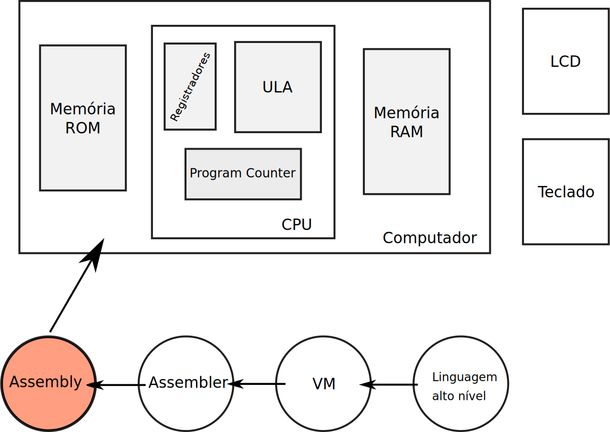

# F - Assembly



Nesse projeto cada grupo terá que implementar diversos códigos em assembly a fim de entendermos a linguagem e as limitações do hardware propostos.

## Instruções 

Seguir as intruções a seguir para desenvolvimento do projeto.

## Entendendo a Organização do Projeto

A pasta do projeto D, no repositório Z01, possui a seguinte estrutura:

```
F-Assembly/
  testeAssembly.py
  Z01simulator.py
  /Quartus
  /src
      /nasm
          *.nasm
  /tests
      /tst
          /abs
          /add
          ....
```

1. `Quartus`: Projeto Quartus para gravar o computador na FPGA
1. `*.py`: Scripts em python que automatizam a execução dos testes;
1. `src/nasm/*.nasm`: Arquivos ASSEMBLY que serão implementados pelo grupo;
1. `tests/tst/*`: Arquivos que realizam o teste nos arquivos códigos do rtl.

### Executando o Script de Teste 

Abra o terminal na pasta `F-Assembly/` e execute o script python localizado nessa pasta:

```bash
$ ./testeAssembly.py
```

O mesmo irá compilar os arquivos `src/rtl/*.nasm` e executar os testes unitários em cada um deles. Nesse momento do teste, como os módulos não estão implementados, o resultado deverá ser falho.

Esse comando executa um teste unitário em cada um dos módulos, verificando se sua implementação está correta. O resultado é exibido na tela como : **pass** ou **fail**.


!!! tip
    Lembrando que o arquivo tests/config.txt define quais testes serão executados.

## Projeto

Deve-se implementar diversos programas na linguagem de máquina do Z01 que irão manipular a memória RAM a fim de implementar o que é pedido. **A descrição a seguir está classificada em ordem de dificuldade, começando pelos mais simples.**


### Módulos 

- Esses arquivos estão localizados em `F-Assembly/src/nasm/`

**A descrição de cada módulo está localizada no cabeçalho do arquivo.**
 
- mov
    - **Arquivo**   : `mov.nasm`            
- add
    - **Arquivo**   : `add.nasm`
- sub
    - **Arquivo**   : `sub.nasm`
- abs
    - **Arquivo**   : `abs.nasm`
- pow
    - **Arquivo**   : `pow.nasm`
- fatorial
    - **Arquivo**   : `fatorial.nasm`
- mod
    - **Arquivo**   : `mod.nasm`
- Chaves e Leds 
    - **Arquivo** : `SWeLED.nasm`
- Linha
    - **Arquivo**   : `line.nasm`
- Quadrado
    - **Arquivo**   : `quadrado.nasm`
- Letra Grupo
    - **Arquivo**   : `LCDletraGrupo.nasm`

#### Conceito B

- String length 
    - **Arquivo** : `stringLength.nasm`
- É par 
    - **Arquivo** : `isEven.nasm`
- Palindromo 
    - **Arquivo** : `palindromo.nasm`
- Nome grupo
    - **Arquivo** : `LCDnomeGrupo.nasm`

#### Conceito A

- Nome grupo
    - **Arquivo** : `jogo.nasm`

## Rubricas para avaliação de projetos

Cada integrante do grupo irá receber duas notas: uma referente ao desenvolvimento total do projeto (Projeto) e outra referente a sua participação individual no grupo (que depende do seu papel).

### Projeto

| Conceito |                                                                |
|----------|----------------------------------------------------------------|
| I        | - Menos da metade dos módulos funcionando                      |
|          |                                                                |
| D        | - Ao menos um módulo não está feito e não passa no testes.     |
|          |                                                                |
| C        | - Configurou o travis para operar com o novo projeto.          |
|          | - Todos os módulos sendo testados no Travis.                   |
|          | - Todos os módulos passam nos testes.                          |
|          | - Programa que desenha a letra do grupo no LCD             |
|          |                                                                |
| B        | - Escreve o nome do grupo no LCD                  |
|           | (grava vídeo) |
|          | - Implementa os módulos extras (`stringLength.nasm`, ... )     |
|          |                                                                |
| A        | - Faz algum jogo com o Z01.1    (`jogo.nasm`)                  |
|          | (grava vídeo)    |


!!! tip "Dicas rubrica A/B"
    [Veja a dicas para as rubricas A e B](/F-Assembly-Dicas/)
