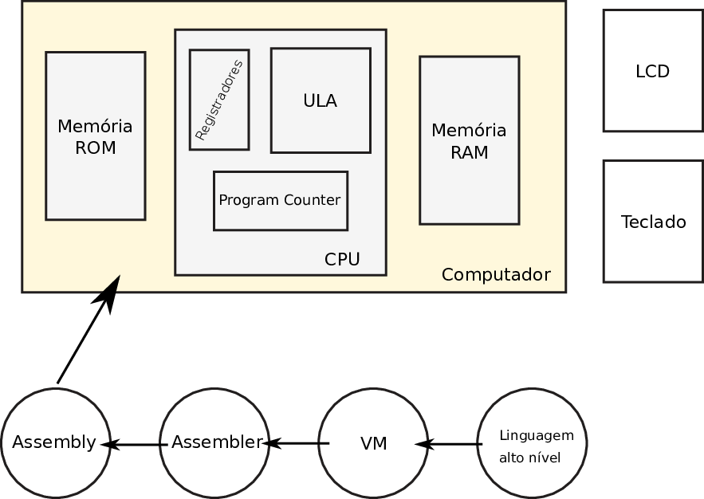
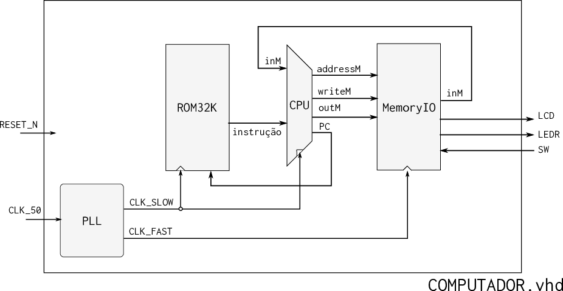
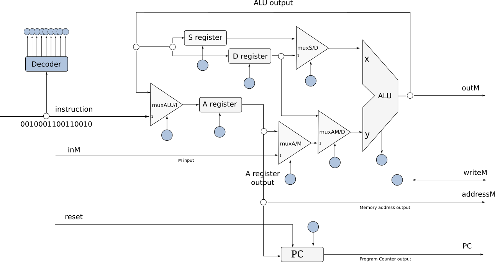
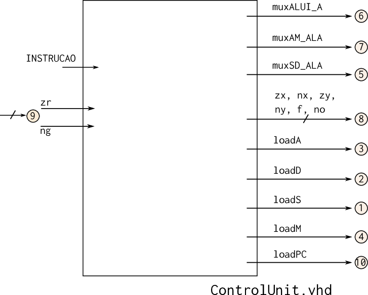

# G - CPU




Nesse projeto cada grupo terá que implementar diversos codigos em assembly a fim de entendermos a linguagem e as limitações do hardware propostos.

## Instruções 

Seguir as intruções a seguir para desenvolvimento do projeto.

### Entendendo a Organização do Projeto

A pasta do projeto G no repositório Z01, possui a seguinte estrutura:

```
G-Computador/
    testeHW.py
    testeAssemblyMyCPU.py
    Z01SimuladorMyCPU.py
    generateMySOF.py
    programMySOF.py
    programNASM.py
    Quartus/
        ...
    Z01-Simulator-RTL/
        ...
```

1. `testeHW.py`: Testa o `controlUnit.vhd` e `memoryIO.vhd`
1. `testeAssemblyMyCPU.py`: Testa todo o HW do computador (`CPU.vhd`)
1. `Z01SimuladorMyCPU.py`: Abre o simulador gráfico do Z01.1 com o HW do grupo
1. `programMySOF.py`: Programa a FPGA com o HW do grupo
1. `programNASM.PY`: Programa a ROM do Z01.1 da FPGA com um nasm passado
1. `Z01-Simulator-RTL` : Pasta com o simulador do computador (usa o hardware criado por vocês)

### Testando HW (ControlUnit e MemoryIO)

Abra o terminal na pasta `G-CPU` e execute o script python localizado nessa pasta:

```bash
$ ./testeHW.py
```

!!! warning
    Esse script testa apenas uma pequena parte
    do Control Uniy e do MemoryIO!

    Passar nesse teste não indica 100% que o projeto está correto.

É possível testar apenas o controlUnit ou MemoryIO, execute o comando com: `lib.tb_controlunit.all` ou `lib.tb_memoryio.all` para testar apenas um módulo. 

```bash
$ ./testeHW.py lib.tb_memoryio.all 
$ ./testeHW.py lib.tb_controlunit.all
```

## Testando o projeto completo

Para testar se o computador está correto, iremos executar alguns programas realizados na etapa `F-Assembly` porém agora no Harware que vocês montaram. Para isso execute.

```bash
$ ./testeAssemblyMyCPU.py
```

Esse script irá compilar todos os módulos (desde o projeto C) e executar o top level `Computador.vhd`, iremos comparar se a resposta (memória RAM) possui o resultado esperado. Como os programas são complexos, esperamos com isso conseguir testar a totalidade do projeto.

## Travis

Adicione ao Travis os dois testes, separando o memoryIO e o controlUnit:

- `testeHW.py lib.tb_memoryio.all`
- `testeHW.py lib.tb_controlunit.all`
- `testeAssemblyMyCPU.py`


# Projeto

Deve-se implementar o `Control Unit` e integrar os módulos: `MemoryIO` e `CPU`. O HDL que descreve o `Computador` já foi fornecido pronto.

## Módulos 


!!! note
    Esses arquivos estão localizados em `G-Computador/src/rtl/`

Os módulos estão listados de maneira Top - Down

---------------------------
 
- Computador (já está pronto!)
    - **Arquivo**: `computador.vhd`
    - **Descrição**: TopLevel do projeto, entidade que integra a memória ROM o MemoryIO, CPU e PLL
    - **Dependências**:
         - `Dispositivos/ROM/ROM32K.vhd`: ROM a ser utilizada no projeto (já foi dado pronto)
         - `Dispositivos/PLL/PLL.vhd`: PLL a ser utilizada no projeto (já foi dado pronto)
    
             
---------------------------

- MemoryIO
    - **Arquivo**   : `MemoryIO.vhd`
    - **Descrição** : Faz o mapa de memória para a CPU.
    - **Dependências** :
         - `Dispositivos/RAM/RAM16K.vhd` : RAM a ser utilizada no projeto (já foi dado pronto)
         - `Dispositivos/Screen/Screen.vhd` : Controlador do LCD a ser utilizada no projeto (já foi dado pronto)
    
    
---------------------------

- CPU
    - **Arquivo**   : `CPU.vhd`
    - **Descrição** : CPU do Z01 integra registradores, controlUnit, ULA e PC.
    - **Dependências** :
         - `ControlUnit.vhd` : Unidade de controle a ser implementada
         - `ULA.vhd` : Unidade lógica desenvolvida no projeto D
         - `PC.vhd` : Program counter do projeto E
         - `register16.vhd`, `mux16.vhd` : Componentes do projeto C e D 
    

---------------------------

- ControlUnit
    - **Arquivo**   : `ControlUnit.vhd`
    - **Descrição** : Unidade de controle da CPU do Z01.
    - **Dependências** :
         - não há 
         
### Diagramas 

---------------------------



---------------------------


---------------------------



---------------------------

ControlUnit



---------------------------

# Rubricas para avaliação de projetos

Cada integrante do grupo irá receber duas notas: uma referente ao desenvolvimento total do projeto (Projeto) e outra referente a sua participação individual no grupo (que depende do seu papel).

## Projeto

| Conceito |                                                                                   |
|----------|-----------------------------------------------------------------------------------|
| I        | - Menos da metade dos módulos funcionando                                         |
|          |                                                                                   |
| D        | - Ao menos um módulo não está feito e não passa no testes.                        |
|          |                                                                                   |
| C        | - Construiu com os módulos do grupo o seu próprio computador                      |
|          | - Todos os módulos sendo testados no Travis.                                      |
|          | - Todos os módulos passam nos testes.                                             |
|          | - Executa o escreve a letra do grupo no LCD usando o seu computador               |
|          |                                                                                   |
| B        | - Adiciona um novo registrador a CPU                                              |
|          | - Adiciona os displays de Sete Segmentos aos periféricos do Computador (memoryIO) |
|          | - Faz um código e um vídeo que demonstra que ambos estão funcionando              |
|          |                                                                                   |
| A        | - Possibilita realizar carregamento efetivo em %D (`leaw $5, %D`)  **OU**         |
|          | - Adiciona um teclado (externo) como um novo periférico                           |
|          | - Faz um código e um vídeo que demonstrando seu funcionamento                |


!!! note "Conceito A"
    Para o conceito A é necessário realizar apenas um item da lista.
