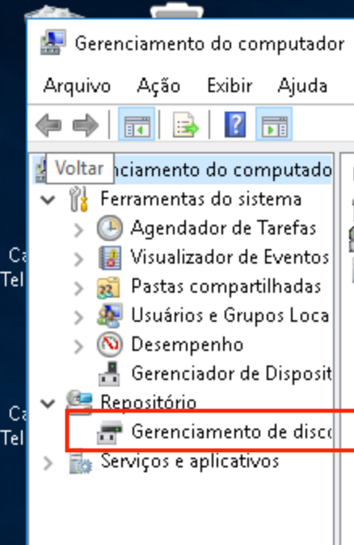

Através deste guia, você conseguirá criar uma máquina virtual no VirtualBox que realiza o boot de um HD Externo, este roteiro foi feito e testado no Windows 10 (mas com o devido cuidado funciona no Mac OS e Linux também).

1. Antes, verifique se não há nenhum pendrive, se sim, ejete ele no Windows Explorer.

2. Conecte o HD Externo de tipo A (MBR) no Windows, neste momento deverá aparecer uma mensagem dizendo para formatar a unidade para poder utiliza-la, clique em Não.

3. Agora, abra o Painel de Controle, procure por Ferramentas Administrativas e em seguida Gerenciamento do Computador (Cuidado para não confundir com Gerenciador de Dispositivos!).

4. Agora no menu lateral, procure por Gerenciamento de Discos, na parte central, você deve ser capaz de ver o seu HD e o HD Externo conectado, caso contrário, verifique a conexão USB e certifique-se que clicou no botão Ignorar ao conecta-lo.

5. Com foco no HD Externo e procure pelo número do Disco (geralmente fica na parte inferior em baixo do nome, no gráfico de barras). Deve haver algo como `Disco 2` ou `Disco 1`. 

6. Agora, abra uma Linha de Comando como Administrador (botão direito, e executar como Administrador). Navegue até a pasta do VirtualBox em `C:\Program Files\Oracle\VirtualBox` e execute o seguinte comando, substituindo o N pelo número de disco corresponde visto anteriormente (deve-se manter o \\.\PhysicalDrive).
`VBoxManage internalcommands createrawvmdk -filename Elementos.vmdk -rawdisk \\.\PhysicalDriveN`

Se tudo ocorrer bem, deve aparecer a mensagem `RAW host disk access VMDK file Elementos.vmdk created successfully.` Caso sim, continue, caso contrário, verifique o comando digitado.

7. No passo 6, criamos um disco virtual, que na realidade não armazena dados e sim diz ao VirtualBox procurar pelo HD Externo. No entanto, este acesso ao HD Externo em nível de partições de boot, necessita de acesso de administrador ao computador. Portanto, vamos ter que abrir o VirtualBox como administrador no Windows. Primeiro, certifique-se que o VirtualBox está fechado completamente. Procure qualquer atalho ou no menu Iniciar pelo VirtualBox e clique com botão direito e Executar como Administrador.

8. Com êxito, a janela do VirtualBox deve aparecer. Clique para criar uma nova máquina virtual, clique em seguida no modo Expert, de um nome apropriado a máquina virtual, na pasta da máquina virtual, sugiro que mude o caminho para C:\Users\SEU_USUARIO\VirtualBox VMs (crie caso não exista). Ele irá utilizar esta pasta apenas para arquivos de configuração. Troque o Tipo para Linux e Versão para Ubuntu (64-bits). É recomendável que aloque pelo menos 4GB (4096 MB) para o sistema. Na opção de Disco Rígido, escolha a opção Utilizar um disco virtual existente, e selecione o arquivo Elementos.vmdk criado no passo 6. Clique em Criar.

9. Clique para executar a máquina virtual criada, se tudo ocorrer bem, você deve ver o boot do Ubuntu iniciando, não esqueça depois de ligar, de verificar a resolução da tela e se a aceleração de vídeo está habilitada.